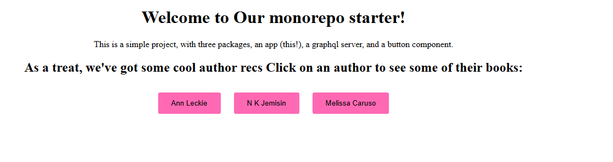

# Monorepo Project

## Overview

This is a monorepo project that contains multiple packages and applications. The project uses `yarn` for package management and dependency resolution.

- **packages/**: Contains shared libraries and utilities.
- **apps/**: Contains the main applications.

## Getting Started

### Prerequisites

- [Node.js](https://nodejs.org/) (version 20 or higher)
- [Yarn](https://yarnpkg.com/) (version 1.22 or higher)

### Installation

1. Clone the repository:

   ```sh
   git clone https://github.com/halilural/monorepo-starter.git
   cd monorepo-starter
   ```

2.  Install dependencies:

    ```sh
    yarn install
    ```

### Running Applications

1. Navigate to the graphql service directory and start the service:

    ```sh
    cd services/graphql-api
    yarn start
    ```
2. Navigate to the nextjs app and start the app.

    ```sh
    cd apps/next-app
    yarn dev
    ```

### Show the app.

Go to http://localhost:3000 on your browser.

